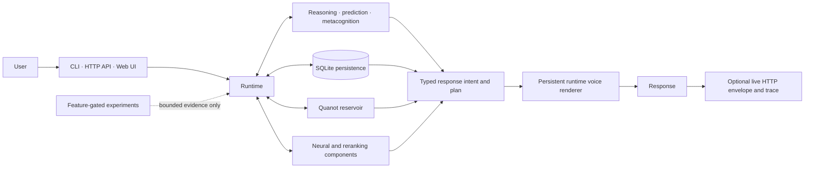

<div align="center">

# ✦ Starfire

### A local-first developmental intelligence research system built in Rust

Starfire studies whether persistent memory, prediction, structured reasoning, bounded learning, and proof-carrying abstraction can produce measurable cumulative improvement without relying on model scale alone.

[](Cargo.toml)
[](LICENSE)
[](docs/CURRENT_STATUS.md)
[](docs/deployment.md)

[Documentation](docs/README.md) · [Current status](docs/CURRENT_STATUS.md) · [EI plan](plans/EMERGING_INTELLIGENCE_PIVOT.md) · [EI-0 tracker](https://github.com/toxzak-svg/starfire/issues/149) · [Architecture](docs/architecture.md) · [Experiments](docs/experiments/README.md)

</div>

> [!IMPORTANT]
> **Starfire is research software, not a demonstrated AGI, an established emerging intelligence, or a validated consciousness system.** The repository contains working runtime capabilities alongside preregistered, feature-gated experiments. Documentation uses explicit status labels so ambition, implementation, and evidence do not blur together.

## What Starfire is

Starfire is an attempt to build useful intelligence from **developmental system architecture rather than model scale alone**. The project is centered on a long-lived Rust runtime that can preserve identity and memory, reason over structured state, inspect uncertainty, and construct responses through typed internal contracts.

The active research program asks one central question:

> **Does Starfire become measurably better because it experienced the past?**

The Emerging Intelligence program requires any positive answer to survive matched no-update, memory-disabled, random-update, and fixed-policy controls, plus held-out transfer and deterministic replay. Until that evidence exists, emerging intelligence remains the research target rather than a present capability.

The repository includes:

- a local CLI and HTTP API;
- SQLite-backed identity, memory, beliefs, and session continuity;
- symbolic reasoning, analogy, synthesis, prediction, and metacognitive subsystems;
- **Quanot**, a Rust-native reservoir-computing substrate;
- a trained character-level reranker and additional neural components;
- typed response intents, persistent runtime voice dimensions, and inspectable response plans;
- a Next.js web chat with memory, cognition, and live-response metadata views;
- a large experimental program with frozen controls, neutral fallbacks, and explicit authority boundaries.

## Active research program

The merged [Emerging Intelligence pivot](plans/EMERGING_INTELLIGENCE_PIVOT.md) changes the unit of progress from **module completed** to **capability acquired and independently measured**.

The first milestone is **EI-0: Developmental Loop**. Its implementation and evidence sequence is tracked in [issue #149](https://github.com/toxzak-svg/starfire/issues/149):

1. secure and isolate untrusted runtime surfaces;
2. define canonical episode and prediction contracts;
3. build frozen developmental environments and matched controls;
4. add append-only replayable episode evidence;
5. implement narrow reversible learning updates;
6. preregister and execute the terminal EI-0 comparison;
7. consider shadow runtime observation only after a bounded PASS.

No EI stage automatically authorizes the next stage, and no stage authorizes unrestricted self-modification, ontology promotion, tools, or autonomy.

## System map



The diagram is deliberately asymmetric: experiments do not automatically gain runtime authority. A research module must cross its own preregistered gates before it can influence a live path.

## Current portrait

| Area | Main-branch state |
|---|---|
| Local runtime | CLI chat, status command, and HTTP server |
| Continuity | SQLite persistence for identity, memories, beliefs, and sessions |
| Cognition | Reasoning, prediction, metacognition, curiosity, world-model, and Quanot modules |
| Language path | Runtime-owned typed response plans plus persistent voice rendering |
| Learned component | Bundled native CharRNN reranker checkpoint |
| Web interface | Next.js 16 / React 19 chat UI with cognitive and memory drawers |
| Deployment | Dockerized API on Render; web UI designed for Vercel or local use |
| Active research direction | EI-0 developmental loop, currently planned and tracked but not yet established by a terminal result |
| Experimental tracks | Companion policy, STLM, ΩV1 voice, developmental, relational, and grammar-abstraction probes |
| Default safety posture | Research features default off unless explicitly compiled or enabled |

See [Current Status](docs/CURRENT_STATUS.md) for the exact main-branch boundary, known seams, and work that remains outside production.

## Quick start

### Requirements

- a current stable Rust toolchain;
- Git;
- Node.js 20+ only when running the web UI.

### Run the local CLI

```bash
git clone https://github.com/toxzak-svg/starfire.git
cd starfire

cargo run --release -p star_bin --bin star -- chat
```

Use a dedicated data directory when you want an isolated local state:

```bash
cargo run --release -p star_bin --bin star -- \
  --data-dir ./data/dev chat
```

### Start the API

```bash
cargo run --release -p star_bin --bin star -- \
  --data-dir ./data/dev \
  api --host 0.0.0.0 --port 8080
```

Then send a message:

```bash
curl http://localhost:8080/chat \
  -X POST \
  -H "Content-Type: application/json" \
  -d '{"message":"What are you uncertain about right now?"}'
```

### Start the web UI

```bash
cd ui
npm install
NEXT_PUBLIC_STAR_API=http://localhost:8080 npm run dev
```

Open `http://localhost:3000`.

## Useful commands

```bash
# Runtime status
cargo run --release -p star_bin --bin star -- status

# Workspace tests
cargo test --workspace --locked

# Library tests only
cargo test -p star --locked

# Production-style image
docker build -t starfire .
docker run --rm -p 8080:8080 -v starfire-data:/data starfire
```

The production Docker build intentionally runs a long chain of frozen experiment and asset gates before publishing the binary. For ordinary development, use targeted Cargo tests instead of rebuilding the image after every edit.

## Runtime configuration

| Variable | Default | Purpose |
|---|---:|---|
| `STARFIRE_DATA` | platform data directory, `/data` in the container | Persistent runtime files and models |
| `STARFIRE_HOME` | unset | Fallback location for runtime-owned state |
| `STARFIRE_PORT` | `PORT` or `8080` | HTTP listen port in the container |
| `STARFIRE_LOG` | `info` in the container | Runtime logging level |
| `STARFIRE_RUNTIME_VOICE` | `1` | Set to `0` to disable persistent runtime voice modulation |
| `STARFIRE_OMEGA_V1F2_SHADOW` | `0` | Explicitly enables the ΩV1-F2 post-response shadow observer |
| `NEXT_PUBLIC_STAR_API` | hosted Render API | API base URL used by the web UI |
| `TELEGRAM_BOT_TOKEN` | unset | Enables Telegram reply delivery for webhook traffic |

## Repository guide

```text
starfire/
├── src/                  # star_bin: CLI, API entry point, live HTTP wrapper
├── lib/                  # star: cognition, persistence, runtime, experiments
├── ui/                   # Next.js web chat
├── docs/                 # living docs, architecture, API, evidence records
├── plans/                # research and implementation plans
├── scripts/              # evaluation, traffic, and integration tooling
├── data/                 # local assets and model checkpoints
├── Dockerfile            # gated Render production image
├── render.yaml           # Render service blueprint
├── SPEC.md               # current project specification
└── IDENTITY.md           # bundled Star identity source
```

## Research discipline

Starfire’s experiment tree is intentionally stricter than a normal application feature backlog.

1. **Preregister the hypothesis and authority boundary.**
2. **Build the smallest testable implementation.**
3. **Run matched controls and failure cases.**
4. **Record PASS, FAIL, or collecting without rewriting prior evidence.**
5. **Promote only the authority explicitly authorized by the previous gate.**

A PASS in an offline selector does not silently authorize live text. A shadow observer does not silently authorize routing. A promising diagnostic does not authorize automatic ontology promotion. These separations are part of the architecture, not paperwork around it.

For the current critical path, use the [EI plan](plans/EMERGING_INTELLIGENCE_PIVOT.md) and [EI-0 master tracker](https://github.com/toxzak-svg/starfire/issues/149). For prior evidence, use the [experiment index](docs/experiments/README.md) and [documentation map](docs/README.md).

## Known limits

- Starfire is not currently competitive with frontier LLMs for broad fluent conversation or world knowledge.
- EI-0 has no terminal result yet, so the project has not established emerging intelligence under its own definition.
- Several subsystems are research prototypes whose scientific labels are narrower than their names may suggest.
- Some older documents are historical records and intentionally retain the language and assumptions of their time.
- The hosted system is a research deployment. It has no built-in authentication, multitenant isolation, or production-grade rate limiting.
- Automatic latent-concept or ontology promotion remains outside the authorized live boundary.

## Project philosophy

> Build the smallest architecture that can produce evidence, preserve the evidence when it fails, and only then grant it more power.

Starfire’s long-term ambition is substantial. Its present-tense claims remain deliberately smaller.

## License

Starfire is available under the [MIT License](LICENSE).
