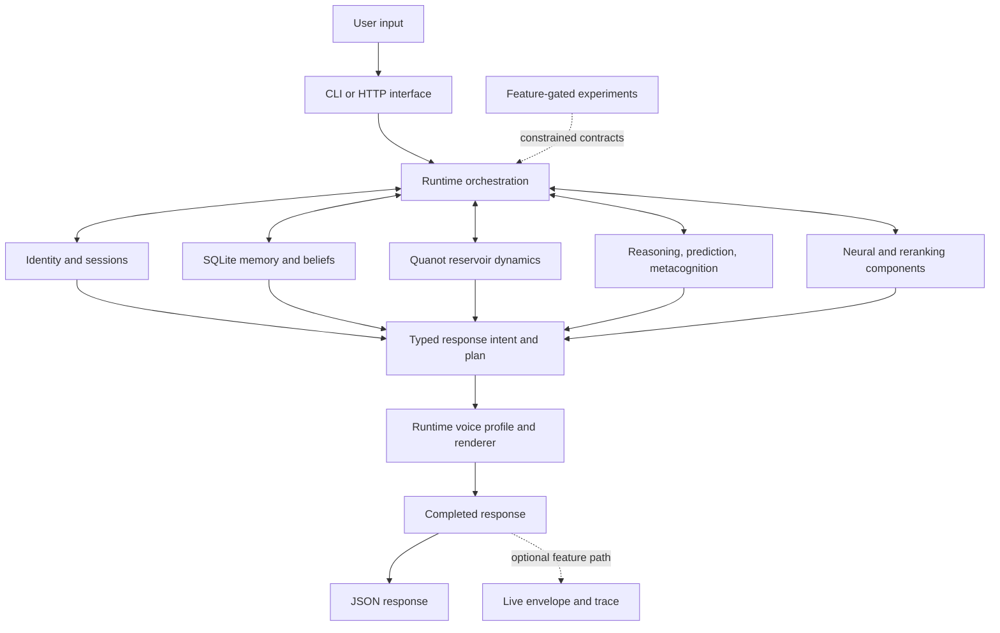

# Starfire Specification

> **Document type:** living specification  
> **Applies to:** `main`  
> **Last updated:** 2026-07-21

Starfire is a local-first experimental cognitive architecture. Its central thesis is that useful, persistent, inspectable intelligence may emerge from the interaction of memory, reasoning, prediction, metacognition, neural dynamics, and typed behavioral contracts rather than parameter scale alone.

This document defines the system Starfire is intended to be, the behavior currently authorized on the main branch, and the claims the project does **not** make.

## 1. Evidence language

Every project document should use one of these labels:

| Label | Meaning |
|---|---|
| **Runtime** | Present in the normal executable path on `main` |
| **Feature-gated** | Implemented, but absent unless a Cargo feature is enabled |
| **Shadow** | May observe or score runtime behavior but may not change the returned result |
| **Experimental** | Exists to produce bounded evidence; not automatically product behavior |
| **Planned** | Design intent without an accepted implementation |
| **Historical** | Preserved record of an earlier architecture, result, or assumption |

A module name, successful unit test, or merged experiment does not by itself establish intelligence, consciousness, generality, or safety.

## 2. Present-tense project claim

Starfire currently provides:

- a Rust CLI and HTTP service;
- persistent local identity, memory, beliefs, and sessions;
- symbolic, predictive, metacognitive, reservoir, and learned components;
- typed response-intent and response-plan machinery;
- a persistent runtime voice profile with an explicit kill switch;
- a Next.js chat interface;
- a feature-gated experiment framework with replay, controls, and authority boundaries;
- a Docker deployment whose build runs frozen verification gates.

Starfire is **not** currently a demonstrated AGI, a frontier-grade conversational model, or evidence of machine consciousness.

## 3. Design principles

### 3.1 Local-first continuity

The core runtime must remain usable without a required cloud inference provider. Identity and personal state should live in a user-controlled data directory. Hosted deployment is an interface option, not the definition of the system.

### 3.2 Architecture before scale

Starfire may use learned components, but no single model is treated as the whole intelligence. Memory, reasoning, metacognition, prediction, state transitions, response construction, and verification remain explicit architectural objects.

### 3.3 Typed authority

Research modules receive only the authority their previous gate permits. Authority is divided into distinct capabilities such as:

- reading raw prompts;
- reading unrestricted memory;
- mutating persistent state;
- influencing returned text;
- routing requests;
- selecting tools;
- promoting beliefs or ontology;
- authorizing external action.

Passing one gate never implies all of the others.

### 3.4 Neutral fallback

A bounded renderer, selector, verifier, or observer must have a deterministic fallback. Corrupt state, stale digests, invalid plans, timeouts, panics, and missing artifacts must not silently widen behavior.

### 3.5 Inspectability

Important state transitions should be representable as typed structures, replayable records, or bounded traces. Human-readable prose alone is not sufficient evidence for a cognitive claim.

### 3.6 Preserved failure

Observed failures remain failures. Remediation receives a new identifier and new result record rather than relabeling the original run.

## 4. Runtime architecture

### 4.1 Interface layer

The `star_bin` crate provides:

- `star chat` for an interactive terminal session;
- `star status` for a runtime status summary;
- `star api` for the HTTP service.

The `ui/` application is a separate Next.js client that talks to the HTTP service.

### 4.2 Persistence

The `star` library owns persistent identity, memories, beliefs, and sessions through SQLite and runtime files under the configured data directory.

Persistence contracts:

- an explicit `--data-dir` is treated as the exact storage root;
- container deployments use `STARFIRE_DATA`;
- identity and bundled model assets are seeded only when the persistent copy is absent or empty;
- user-edited persistent assets must survive redeployment;
- experimental state must not be confused with established memory or belief without a typed promotion step.

### 4.3 Cognition

The library contains multiple interacting families rather than one linear pipeline:

- symbolic and graph-based reasoning;
- analogy and synthesis;
- prediction and attractor-oriented mechanisms;
- metacognitive confidence, critique, and gap tracking;
- curiosity and background-thought machinery;
- world-model and causal structures;
- Quanot reservoir dynamics and derived metrics;
- neural modules and a trained character-level reranker.

Names such as “consciousness proxy,” “creativity,” or “emergence” identify internal metrics or research hypotheses. They are not proof of the corresponding philosophical property.

### 4.4 Response construction

Migrated runtime handlers construct typed response information before surface rendering. The current runtime voice profile tracks bounded dimensions including directness, warmth, compression, and initiative.

Runtime voice contracts:

- enabled by default;
- disabled with `STARFIRE_RUNTIME_VOICE=0`;
- persisted as `runtime_voice_profile.json` beneath the runtime data root;
- revised from explicit correction language such as requests for greater directness, warmth, detail, brevity, or initiative;
- must not require storing raw conversation text in the profile file;
- remains subordinate to the content and safety decisions of the runtime handler.

### 4.5 HTTP boundary

The base API exposes chat, reasoning, memory, identity, cognitive, metacognitive, and autonomous-thought endpoints.

The production Docker feature currently also includes a live HTTP layer that can add typed plan and voice metadata to successful `/chat` responses and expose `/live/status`. This wrapper is documented as a separate boundary because it has its own persistence and trace behavior.

See [`docs/api.md`](docs/api.md) for the wire contract and [`docs/architecture.md`](docs/architecture.md) for the implementation map.

## 5. Experimental architecture

Experiments are organized as ladders. Typical stages include:

1. frozen baseline;
2. typed shadow state;
3. semantic-plan shadow;
4. deterministic bounded influence;
5. independent verification;
6. offline learned selection;
7. post-response shadow observation;
8. separately preregistered canary, if authorized.

The repository currently includes experiment families for:

- companion observation and interaction policy;
- state-transition language modeling;
- ΩV1 cognitive-to-voice work;
- developmental and residual reasoning;
- relational transfer and IngExuity integration;
- bounded grammar extension and abstraction reuse;
- autonomous-kernel and endogenous-state-space research.

Experiment documents are evidence records. They should not be rewritten merely to make the current story cleaner.

## 6. Safety and authority boundary

The default live system does not authorize unrestricted autonomous action, self-replication, automatic tool use, or automatic ontology promotion.

The following require separate, explicit gates:

- converting latent patterns into durable concepts;
- changing live routing from learned proposals;
- selecting or executing external tools;
- modifying identity facts;
- promoting unverified observations into beliefs;
- taking external actions without user authorization;
- widening a shadow observer into a response-producing component.

Automatic latent-concept promotion remains prohibited until a later frozen experiment survives matched-budget controls and held-out transfer.

## 7. Data and privacy contracts

### Local runtime

- State should remain under the configured data root.
- SQLite and JSON files are inspectable by the operator.
- External network calls are optional integrations, not a requirement for continuity.

### Hosted runtime

- The current research API has no built-in user authentication or multitenant isolation.
- Operators must not treat a public deployment as a private personal-memory service without adding access control.
- The optional live trace contains response and plan information and must be treated as potentially sensitive operational data.
- Logs and persistent disks require the same protection as conversation records.

## 8. Interface acceptance criteria

A normal runtime build should:

- start the CLI or API without an external model service;
- initialize a persistent data directory;
- load identity and available model assets;
- preserve state across restarts;
- return valid JSON from documented HTTP routes;
- retain deterministic fallback behavior when optional features are unavailable.

The web UI should:

- normalize the configured API URL;
- display connection state honestly;
- preserve the base `response` contract;
- display live metadata only when the server supplies it;
- label failure-open or legacy responses rather than presenting them as live-plan output.

## 9. Build and release contracts

The production image is built from `Dockerfile` and deployed from `main` through `render.yaml`.

Before the release binary is copied into the runtime image, the builder verifies:

- bundled identity and reranker assets;
- frozen ΩV1 baseline and state contracts;
- semantic-plan and bounded-live contracts;
- independent language verification;
- the offline learned-expression remediation gate;
- the F2 shadow implementation boundary.

A successful image build establishes only that those committed gates passed in that build environment. It does not establish AGI, consciousness, unrestricted correctness, or broad generalization.

## 10. Non-goals and non-claims

Starfire does not currently claim:

- human-level or general intelligence;
- consciousness, sentience, or moral patienthood;
- frontier-model language quality;
- comprehensive factual knowledge;
- safe unsupervised external action;
- scientific validation of every internal metric name;
- that local execution alone guarantees privacy;
- that a passing experiment justifies deployment outside its frozen boundary.

## 11. Documentation sources of truth

Use these documents in order:

1. [`docs/CURRENT_STATUS.md`](docs/CURRENT_STATUS.md) for what is active now;
2. [`docs/architecture.md`](docs/architecture.md) for implementation structure;
3. [`docs/api.md`](docs/api.md) for wire behavior;
4. [`docs/experiments/README.md`](docs/experiments/README.md) for evidence ladders;
5. [`plans/README.md`](plans/README.md) for future work;
6. historical preregistrations and result records for the exact claims of a past experiment.

When a living document conflicts with code, code wins and the document should be corrected. When a current summary conflicts with an immutable result record about what happened in that run, the result record wins for that run.

## 12. Long-term success condition

The long-term research goal is not merely a chatbot with more modules. A meaningful success would require repeatable evidence that Starfire can:

- preserve coherent identity and learned context over time;
- form and revise abstractions from experience;
- transfer those abstractions to held-out tasks;
- reason and plan under explicit budgets;
- recognize uncertainty and seek useful evidence;
- improve without erasing prior failures or violating authority boundaries;
- remain useful on constrained, user-controlled hardware.

That remains a research target, not a present-tense status claim.
