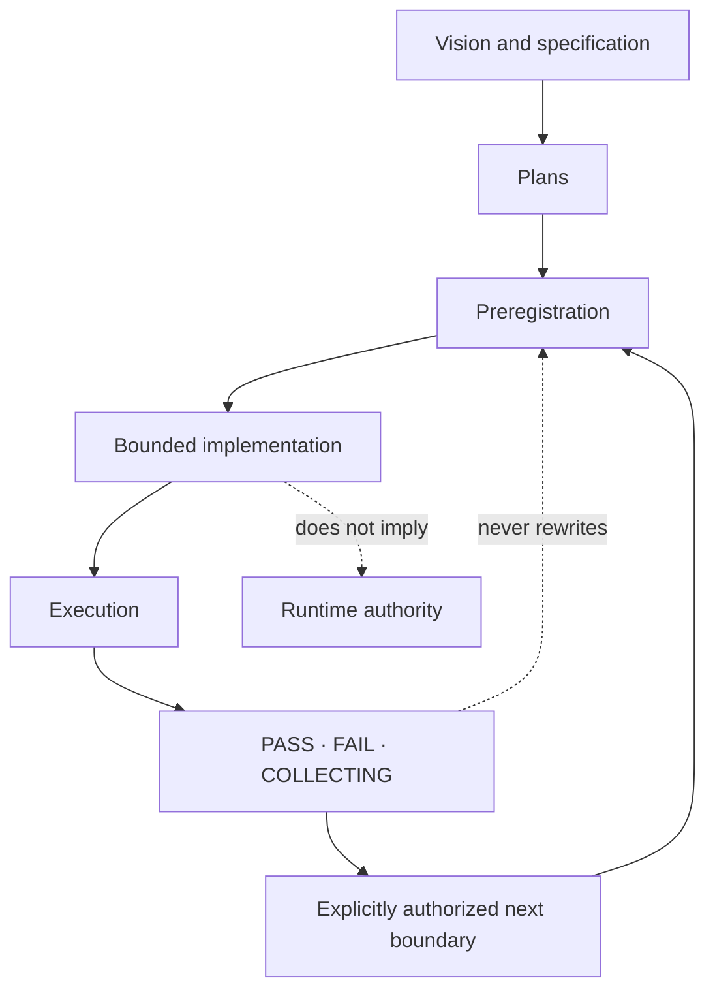

# Starfire Documentation

Starfire’s documentation contains several different kinds of truth. A living architecture guide, a future plan, and a frozen experiment result should not be read as interchangeable evidence.

This index separates them.

## Start here

| Question | Document |
|---|---|
| What is Starfire? | [Project README](../README.md) |
| What is actually active now? | [Current Status](CURRENT_STATUS.md) |
| What are the system contracts? | [Specification](../SPEC.md) |
| How does the code fit together? | [Architecture](architecture.md) |
| How do I call the service? | [API Reference](api.md) |
| How is it deployed? | [Deployment Guide](deployment.md) |
| Which experiments ran and what did they authorize? | [Experiment Index](experiments/README.md) |
| What is planned next? | [Plan Index](../plans/README.md) |

## Document classes

### Living documents

Living documents describe the current main branch and should be updated when the implementation changes.

- [`../README.md`](../README.md)
- [`CURRENT_STATUS.md`](CURRENT_STATUS.md)
- [`../SPEC.md`](../SPEC.md)
- [`architecture.md`](architecture.md)
- [`api.md`](api.md)
- [`deployment.md`](deployment.md)
- this index

When a living document conflicts with current code, code wins and the document should be fixed.

### Architecture records

Architecture records explain a subsystem or research framework in greater depth. Some are current, while others preserve the design at the time they were written.

- [`architecture/STATE_TRANSITION_LANGUAGE_MODEL.md`](architecture/STATE_TRANSITION_LANGUAGE_MODEL.md)
- [`INGEXUITY_STARFIRE_INTEGRATION.md`](INGEXUITY_STARFIRE_INTEGRATION.md)
- [`research/`](research/)

Read their status header and parent experiment before treating them as current runtime behavior.

### Experiment preregistrations

A preregistration freezes a hypothesis, evaluator, controls, thresholds, authority boundary, and promotion rule before the result is known.

Preregistrations should normally be amended only before execution or through an explicit addendum. They are not marketing copy and should not be polished after the outcome becomes inconvenient.

See [`experiments/README.md`](experiments/README.md).

### Experiment results

A result record describes a specific run or external build. It may be `PASS`, `FAIL`, `COLLECTING`, or blocked before evaluation.

Rules:

- a failed run remains failed;
- a remediation receives a new identifier;
- a build failure before the evaluator runs is not an experiment result;
- a PASS authorizes only the next boundary named in the frozen promotion rule;
- later product behavior does not rewrite what the original run established.

### Plans

Plans describe intended work and may contain speculative architecture. They do not prove implementation or success.

See [`../plans/README.md`](../plans/README.md).

### Operational workspace documents

Files such as `AGENTS.md`, `IDENTITY.md`, `SOUL.md`, memory instructions, or tool notes may govern a running workspace or bundled identity. They are not substitutes for the public architecture or current-status documents.

## Status vocabulary

| Term | Use |
|---|---|
| **Runtime** | In the normal executable path on `main` |
| **Feature-gated** | Implemented but absent unless compiled with a feature |
| **Shadow** | Observes or evaluates without changing the returned result |
| **Canary** | Narrow live influence under a frozen boundary |
| **Builder-only** | Runs during release verification, not in the published runtime path |
| **Offline** | Evaluated outside live request handling |
| **Draft** | Not accepted into `main` |
| **Historical** | Preserved record that may not describe current code |
| **Planned** | Intended but not established |

Avoid using “complete” without naming the exact scope. “F2 implementation complete” and “learned voice complete” are very different claims.

## Research map

## Major documentation areas

### Cognitive-to-voice and STLM

The ΩV1 and State Transition Language Model documents cover typed semantic programs, deterministic realization, independent verification, bounded learned selection, and live/shadow promotion.

Start at:

- [`../plans/OMEGAV1_COGNITIVE_TO_VOICE_BRIDGE.md`](../plans/OMEGAV1_COGNITIVE_TO_VOICE_BRIDGE.md)
- [`../plans/STATE_TRANSITION_LANGUAGE_MODEL_PROGRAM.md`](../plans/STATE_TRANSITION_LANGUAGE_MODEL_PROGRAM.md)
- [`architecture/STATE_TRANSITION_LANGUAGE_MODEL.md`](architecture/STATE_TRANSITION_LANGUAGE_MODEL.md)
- [`experiments/README.md`](experiments/README.md)

### Companion and relational cognition

These documents cover explicit-statement observation, prediction ledgers, interaction policies, independent outcome scoring, canaries, and the IngExuity relational bridge.

Start at:

- [`INGEXUITY_STARFIRE_INTEGRATION.md`](INGEXUITY_STARFIRE_INTEGRATION.md)
- [`experiments/README.md`](experiments/README.md)

### Developmental, residual, and abstraction research

H-series, R-series, ΩG, and related documents investigate typed pressure, residual identity, structural transfer, grammar composition, and abstraction reuse.

Start at:

- [`plans/H5_RESIDUAL_IDENTITY_DIAGNOSTIC_PLAN.md`](plans/H5_RESIDUAL_IDENTITY_DIAGNOSTIC_PLAN.md)
- [`experiments/H5_RESIDUAL_IDENTITY_DIAGNOSTIC.md`](experiments/H5_RESIDUAL_IDENTITY_DIAGNOSTIC.md)
- [`research/`](research/)
- [`experiments/README.md`](experiments/README.md)

### Deployment and user-facing system

- [`deployment.md`](deployment.md)
- [`api.md`](api.md)
- [`CURRENT_STATUS.md`](CURRENT_STATUS.md)
- [`../ui/`](../ui/)

## Maintenance checklist

When a runtime or deployment change lands:

1. update `CURRENT_STATUS.md`;
2. update the README portrait if the user-visible capability changed;
3. update `architecture.md` if authority or data flow changed;
4. update `api.md` if a route or envelope changed;
5. update `deployment.md` if build, host, feature, or storage behavior changed;
6. update a plan only when its roadmap changed;
7. append to an experiment record only when the record’s own rules allow it.

## Known historical seams

Older documents may still mention:

- Railway instead of Render;
- a four-layer-only architecture;
- “pure symbolic” reasoning;
- planned components that are now implemented;
- implemented components that have since been superseded;
- broad philosophical language stronger than the evidence supports.

Those statements should not be copied into new summaries without checking current code and `CURRENT_STATUS.md`.
