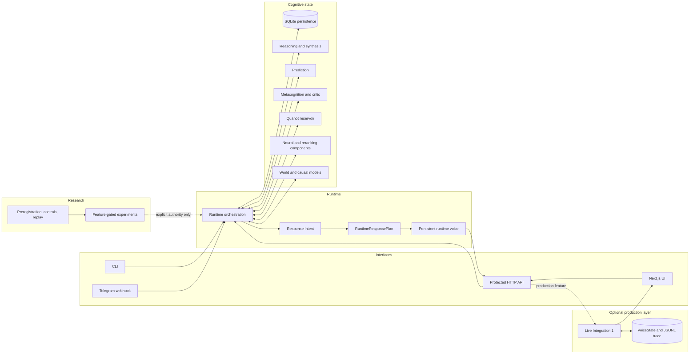

# Starfire Architecture

> **Scope:** current `main` implementation  
> **Last reviewed:** 2026-07-21

Starfire is a Rust workspace with a persistent cognitive runtime, an HTTP/CLI surface, a separate Next.js client, and a large family of feature-gated research modules. It is not accurately described as either “pure symbolic” or “one small language model.” The current system mixes explicit symbolic structures, reservoir dynamics, trained neural components, persistent state, typed response construction, and bounded experiment machinery.

## High-level topology



## Workspace layout

```text
Cargo.toml
├── src/                star_bin executable crate
│   ├── main.rs         CLI, data-root resolution, API startup
│   └── live_api.rs     optional external live HTTP wrapper
├── lib/                star library crate
│   ├── runtime/        orchestration, response intent, tempo, thought
│   ├── persistence/    SQLite stores, identity, memory, sessions
│   ├── reasoning/      symbolic, analogy, pathways, synthesis
│   ├── prediction/     prediction-center mechanisms
│   ├── metacog/        confidence, critique, gaps, reflection
│   ├── quanot/         reservoir, chaos, novelty, creativity metrics
│   ├── neural/         typed neural components
│   ├── language_model/ generation and reranking components
│   ├── user_model/     companion and user-model projections
│   └── examples/       executable probes and frozen evaluators
├── ui/                 Next.js 16 / React 19 web client
├── docs/               living documentation and evidence records
├── plans/              future and historical implementation plans
├── scripts/            evaluation and integration utilities
└── data/               local assets and model checkpoints
```

## Request lifecycle

### 1. Interface and data root

`src/main.rs` exposes three commands:

```text
star chat
star status
star api --host <host> --port <port>
```

An explicit `--data-dir` is an exact storage contract. Without it, the executable uses the platform-local application data directory and retains compatibility with older `life/` layouts.

Container startup is handled by `entrypoint.sh`, which sets the port and data root, seeds bundled assets into persistent storage when needed, and starts the API by default.

### 2. Runtime initialization

`Runtime::new` constructs the long-lived system around the selected data root. The runtime owns access to persistence and coordinates the cognitive modules used by conversation, reasoning, curiosity, and autonomous-thought endpoints.

The architecture is intentionally stateful. A request is not processed by creating a fresh isolated reasoning engine with no history.

### 3. Persistence and retrieval

The persistence family stores identity, memories, beliefs, sessions, companion state, and related projections. SQLite is the primary durable store; some newer bounded runtime states use JSON files beside it.

Important runtime files include:

| File | Purpose |
|---|---|
| SQLite database files | Memories, beliefs, identity, and sessions |
| `IDENTITY.md` | Bundled identity source |
| `runtime_voice_profile.json` | Runtime-owned voice dimensions and revision metadata |
| `live_voice_state.json` | VoiceState used by the optional live HTTP wrapper |
| `live_chat_trace.jsonl` | Append-only live wrapper trace |
| `models/ckpt_e28_b500.pt` | Native CharRNN reranker checkpoint under its historical filename |
| `models/omega_v1f1r1_model.json` | Bounded learned selector artifact for ΩV1-F2 shadow work |

The last three live/experiment files exist only when the corresponding path is active.

### 4. Cognitive processing

Starfire’s cognition is a web of interacting subsystems rather than a clean one-way pipeline.

#### Reasoning

The reasoning family includes graph structures, symbolic inference, analogy, causal and structural mechanisms, pathways, and synthesis. These modules produce explicit intermediate structures that can be inspected and tested independently.

#### Prediction

Prediction modules estimate question gravity, belief revision, attractor behavior, and related forward-looking signals. Their exact runtime influence differs by module and experiment stage.

#### Metacognition

Metacognitive modules track confidence, reasoning history, gaps, critique, and surprising conclusions. They support `/metacog`, `/metacog/insight`, curiosity, and response qualification.

#### Quanot

Quanot is a Rust-native reservoir-computing substrate. It processes encoded input through recurrent dynamics and derives measurements such as novelty, chaos, and a project-specific “consciousness proxy.” These are internal computational signals, not validated evidence of consciousness.

#### Neural and language components

The repository contains neural modules, character-level language machinery, and a trained native CharRNN reranker. This is why older documentation describing Starfire as “no neural networks, pure symbolic” is no longer correct.

### 5. Runtime-owned response construction

`lib/runtime/response_intent.rs` sits inside the real response-generation path for migrated handlers.

It provides:

- `ResponseIntent`, a typed intent classification;
- `RuntimeResponsePlan`, an inspectable rendering plan;
- a persistent voice profile;
- bounded rendering behavior based on directness, warmth, compression, and initiative;
- explicit correction detection;
- `STARFIRE_RUNTIME_VOICE=0` as a kill switch.

The persisted profile contains bounded dimensions and revision metadata. Transient input fingerprints are excluded from serialization.

This layer changes the surface form of runtime-produced responses. It is not merely a UI badge or offline evaluator.

## HTTP surfaces

### Protected API

`lib/api.rs` is the base API. It directly calls the shared `Runtime` and exposes the normal route set. Successful chat returns a JSON object with a `response` string.

When the `omega-v1-f2-shadow` library feature is present and its runtime switch is enabled, the protected API may dispatch a post-response shadow event. The response bytes are frozen before the observer runs.

### Live Integration 1

`src/live_api.rs` is a separate HTTP boundary used when the executable is built with `starfire-live`.

It:

1. starts the protected API on a loopback port;
2. forwards external requests to it;
3. processes successful `/chat` envelopes through a typed semantic plan and `VoiceState`;
4. returns the rendered response plus a `live` metadata object;
5. exposes `GET /live/status`;
6. appends an inspectable JSONL trace;
7. fails open to the protected response when planning or persistence fails.

The production Dockerfile currently builds `star_bin` with `--features starfire-live`, so this wrapper remains part of the deployed path on `main`.

> [!NOTE]
> Some comments introduced during the runtime-owned voice migration describe the older HTTP proxy as “legacy” and say `Runtime::chat` remains the text authority. The executable wiring still starts `src/live_api.rs` under `starfire-live`. The current code therefore contains both runtime-owned voice rendering and the live HTTP wrapper. This is an implementation seam to simplify, not something documentation should hide.

## Web UI

The `ui/` application is a client, not the cognitive runtime.

It currently provides:

- chat input and response display;
- API health and connection state;
- live turn, intent, and trace labels when supplied by the server;
- honest “legacy fallback” labeling when the live layer fails open;
- identity, cognition, metacognition, and memory drawers;
- API URL normalization through `NEXT_PUBLIC_STAR_API`.

The UI sends a `history` array with chat requests, but the protected Rust handler currently deserializes only `message`; unknown JSON fields are ignored. Conversation continuity therefore comes from runtime persistence and state, not that browser array.

## Feature-gated research

`lib/Cargo.toml` defines research features that form dependency ladders. Representative groups include:

| Family | Features | Live authority |
|---|---|---|
| Companion | `companion-observer` through `companion-real-interaction-canary` | Stage-specific; mostly shadow/evaluation |
| STLM | `semantic-response-program`, `deterministic-language-renderer`, `independent-language-verifier` | Offline or builder-only at current gates |
| ΩV1 | baseline, VoiceState, semantic plan, bounded bridge, HTTP canary, learned expression, F2 shadow | Narrow authority per stage |
| Developmental | `developmental-evidence` | Probe/evidence path |
| Relational | `relational-evidence` | Shadow-only bridge |

Features should be read as capability dependencies, not a statement that every included module is simultaneously active in a default local build.

## Build and deployment architecture

The Render image uses a multi-stage Docker build.

The builder:

- verifies bundled identity and reranker assets;
- runs the frozen ΩV1 A, B, C, D0, and D1 contracts;
- runs the independent language verifier;
- reruns the F1R1 learned-expression gate;
- exports and checks the bounded model artifact;
- runs the F2 shadow implementation probe;
- compiles the production binary with `starfire-live`.

The runtime image contains only the executable, canonical assets, entrypoint, certificates, and health-check dependencies. Persistent state is mounted at `/data`.

This makes the Docker build an evidence-bearing release gate, but also makes it intentionally much heavier than a normal application build.

## Trust boundaries

Starfire distinguishes several boundaries that are often collapsed in agent systems:

```text
observe → propose → score → render → return → persist → route → act
```

A module may be authorized for one arrow and forbidden from the next. For example:

- an observer may record digests but not text;
- an offline selector may choose among bounded surfaces but not enter live chat;
- a renderer may alter text but not memory;
- a companion policy may propose metadata but not select tools;
- a diagnostic may identify a latent role but not promote it into ontology.

These boundaries are encoded in feature dependencies, authority structs, tests, preregistrations, and result records.

## Known architectural seams

1. **Two voice paths exist.** Runtime-owned rendering and Live Integration 1 both remain in the production feature graph.
2. **Historical filenames remain.** The native CharRNN checkpoint is stored under a `.pt` filename for compatibility, even though it is not the unrelated PyTorch ZIP previously persisted there.
3. **Error status behavior is inconsistent.** Some application errors are returned as JSON with HTTP 200 by the protected API.
4. **Browser history is not consumed by the Rust chat handler.** The UI sends it, but runtime state is authoritative.
5. **Hosted access is not authenticated.** A public endpoint must not be treated as a secure personal-memory service.
6. **Research terminology can overstate evidence.** Metric names such as consciousness, emergence, and creativity require careful interpretation.

## Related documents

- [Current status](CURRENT_STATUS.md)
- [API reference](api.md)
- [Deployment guide](deployment.md)
- [Experiment index](experiments/README.md)
- [Project specification](../SPEC.md)
- [STLM architecture](architecture/STATE_TRANSITION_LANGUAGE_MODEL.md)
