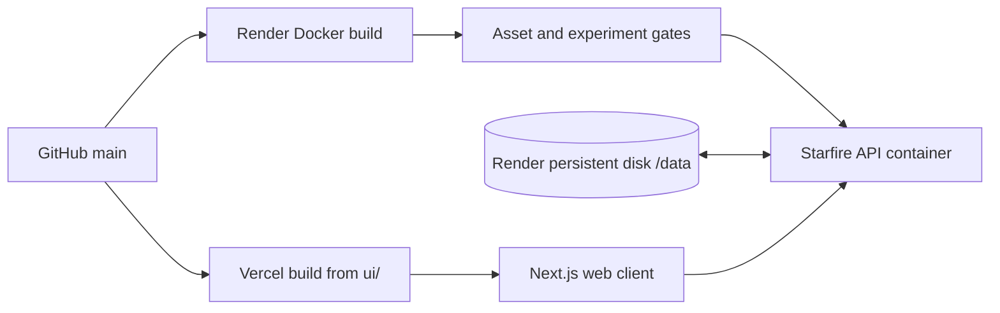

# Starfire Deployment Guide

> **Backend:** Render Docker service  
> **Frontend:** Vercel-compatible Next.js app  
> **Last reviewed:** 2026-07-21

The current deployment path uses `render.yaml`, `Dockerfile`, and `entrypoint.sh`. Older Railway instructions are historical and no longer describe the active service.

## Deployment topology



## Current service endpoints

| Surface | Address |
|---|---|
| Hosted API | `https://starfire-cuee.onrender.com` |
| Health check | `https://starfire-cuee.onrender.com/health` |
| Local API | `http://localhost:8080` |

The web UI defaults to the hosted API when `NEXT_PUBLIC_STAR_API` is not supplied.

## Render backend

### Blueprint

`render.yaml` defines one Docker web service:

- service name: `starfire`;
- branch: `main`;
- Docker context: repository root;
- health check: `/health`;
- auto-deploy: commit;
- persistent data root: `/data`.

Create or refresh the service from the Render dashboard using the repository blueprint. No Railway CLI is involved.

### Why the build is long

The Dockerfile is also a release-evidence gate. Before compiling the production executable, it verifies:

- the full identity asset;
- the native CharRNN reranker checkpoint;
- ΩV1-A baseline fixtures;
- ΩV1-B VoiceState replay;
- ΩV1-C semantic-plan contracts;
- ΩV1-D0 bounded bridge behavior;
- ΩV1-D1 HTTP canary behavior;
- the ΩV1-E independent verifier;
- the F1R1 learned-expression remediation;
- the exported bounded model artifact;
- the F2 shadow implementation boundary.

A failure in any required assertion prevents the image from being published.

The final production command is equivalent to:

```bash
cargo build --release --locked \
  -p star_bin \
  --bin star \
  --features starfire-live
```

### Persistent disk

Mount a Render persistent disk at:

```text
/data
```

The container sets:

```text
STARFIRE_HOME=/data
STARFIRE_DATA=/data
```

The entrypoint seeds canonical assets only when the persistent target is absent or empty. This preserves runtime state and user-edited assets across deployments.

Expected persistent contents include SQLite state, identity, model artifacts, runtime voice state, and optional live traces.

### Backend environment variables

| Variable | Default | Description |
|---|---:|---|
| `STARFIRE_DATA` | `/data` | Persistent data root |
| `STARFIRE_HOME` | `/data` in the image | Fallback state root |
| `STARFIRE_PORT` | `PORT` or `8080` | API port |
| `PORT` | host supplied | Common platform port fallback |
| `STARFIRE_LOG` | `info` | Logging level |
| `STARFIRE_RUNTIME_VOICE` | `1` | Set to `0` to disable runtime-owned voice modulation |
| `STARFIRE_OMEGA_V1F2_SHADOW` | `0` | Enables the F2 post-response shadow observer |
| `STARFIRE_INTERNAL_PORT` | external port + 1 | Loopback protected-API port used by Live Integration 1 |
| `TELEGRAM_BOT_TOKEN` | unset | Telegram Bot API token |

Do not enable an experiment switch merely because its code compiled. Follow the corresponding preregistration and result document.

## Container behavior

With no explicit command, `entrypoint.sh` starts:

```bash
star --data-dir "$STARFIRE_DATA" \
  api --host 0.0.0.0 --port "$STARFIRE_PORT"
```

The health check runs:

```bash
curl -f "http://localhost:${STARFIRE_PORT:-8080}/health"
```

The runtime image contains:

- the `star` executable;
- the canonical `IDENTITY.md`;
- the native CharRNN checkpoint;
- the bounded ΩV1-F1R1 model artifact;
- the entrypoint and health-check dependencies.

## Local Docker run

Build:

```bash
docker build -t starfire .
```

Run with a named persistent volume:

```bash
docker run --rm \
  -p 8080:8080 \
  -v starfire-data:/data \
  starfire
```

Inspect health:

```bash
curl http://localhost:8080/health
```

The full Docker build is intentionally expensive. For ordinary development, run targeted Cargo tests and use a local non-container API process.

## Web UI deployment

The frontend lives under `ui/` and uses Next.js 16 with React 19.

### Vercel settings

| Setting | Value |
|---|---|
| Root directory | `ui` |
| Framework preset | Next.js |
| Build command | `npm run build` |
| Install command | `npm install` |
| Environment variable | `NEXT_PUBLIC_STAR_API=https://starfire-cuee.onrender.com` |

The API client normalizes a scheme-less value and removes trailing slashes.

### Local UI

```bash
cd ui
npm install
NEXT_PUBLIC_STAR_API=http://localhost:8080 npm run dev
```

Open `http://localhost:3000`.

## Deployment verification

After a backend deploy, verify in this order:

```bash
curl -fsS https://starfire-cuee.onrender.com/health
```

```bash
curl -fsS https://starfire-cuee.onrender.com/identity
```

```bash
curl -fsS https://starfire-cuee.onrender.com/chat \
  -X POST \
  -H "Content-Type: application/json" \
  -d '{"message":"Give me a one-sentence status check."}'
```

When the live wrapper is active:

```bash
curl -fsS https://starfire-cuee.onrender.com/live/status
```

Check that:

- `/health` returns `{"status":"ok"}`;
- identity is the full bundled identity, not a minimal fallback;
- chat returns a `response` string;
- optional live metadata is honestly labeled;
- the persistent turn or session state survives a redeploy.

## Troubleshooting

### Build fails during an ΩV1 gate

The Dockerfile prints a report under `/tmp` for each gate and then checks exact fields with `grep`. Find the first failed `RUN` layer. Do not bypass it by deleting the assertion unless the experiment contract is intentionally revised and preregistered.

For faster diagnosis, run the exact Cargo command from the failing Docker layer locally or in another external builder.

### Service starts in chat mode

The container entrypoint should supply the `api` command automatically. Confirm the deployed image uses the current `entrypoint.sh` and has no platform command override replacing it.

### Health check fails

Confirm:

- the service binds to `0.0.0.0`;
- `STARFIRE_PORT` resolves to the platform port;
- the outer live API successfully started its loopback protected API;
- no stale process already occupies the internal port.

Relevant startup messages include the public address and protected loopback port.

### Identity or reranker falls back

The builder validates both assets before publishing. At runtime, inspect `/data/IDENTITY.md` and `/data/models/ckpt_e28_b500.pt`.

The entrypoint replaces one known-bad historical case: a persisted PyTorch ZIP file stored under the native reranker filename. It otherwise preserves non-empty user files.

### Memory resets after deploy

Confirm a persistent disk is mounted at `/data` and `STARFIRE_DATA` still points there. An ephemeral filesystem will lose SQLite state, runtime voice state, and traces whenever the instance is replaced.

### UI says offline

Check browser access to the API health endpoint and verify `NEXT_PUBLIC_STAR_API` was set at build time. Also confirm HTTPS is used when the UI itself is served over HTTPS.

### UI says `online · legacy`

The API is reachable, but the last response lacked live metadata. Check `/live/status` and backend logs. The UI intentionally distinguishes this from a fully active live response path.

### Render cold start

A sleeping or newly deployed service may take time to load assets and initialize the runtime. The client should use a reasonable timeout and treat transport failure separately from an application-level JSON error.

## Security notes

The current service has no built-in authentication or tenant separation. Before using it with private personal memory on a public URL, add an access-control layer and restrict inspection endpoints such as:

- `/identity`;
- `/remember`;
- `/memory/stats`;
- `/cognitive`;
- `/metacog`;
- `/live/status`.

The live trace may contain raw and rendered responses. Treat the persistent disk as sensitive.

## Related documents

- [API reference](api.md)
- [Architecture](architecture.md)
- [Current status](CURRENT_STATUS.md)
- [Experiment index](experiments/README.md)
