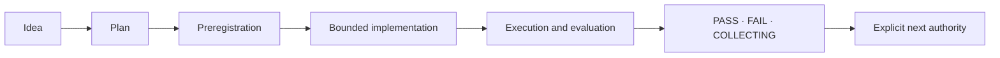

# Starfire Plan Index

Plans describe intended work, experimental sequences, and architectural possibilities. They are not proof that a feature exists, passed evaluation, or entered the live runtime.

For present-tense status, use [`../docs/CURRENT_STATUS.md`](../docs/CURRENT_STATUS.md).

## Active program maps

### Emerging intelligence

- [`EMERGING_INTELLIGENCE_PIVOT.md`](EMERGING_INTELLIGENCE_PIVOT.md)

Recenters Starfire around measurable cumulative improvement caused by experience. The first milestone, EI-0, requires a canonical developmental loop, matched controls, held-out transfer, reversible learning updates, and a full causal report before any live learning authority is considered.

### Cognitive-to-voice

- [`OMEGAV1_COGNITIVE_TO_VOICE_BRIDGE.md`](OMEGAV1_COGNITIVE_TO_VOICE_BRIDGE.md)

Tracks the ΩV1 sequence from baseline measurement through typed state, semantic planning, bounded live influence, independent verification, learned selection, and shadow evaluation.

Current evidence must be read from [`../docs/experiments/README.md`](../docs/experiments/README.md), not inferred from the roadmap’s final rung.

### State Transition Language Model

- [`STATE_TRANSITION_LANGUAGE_MODEL_PROGRAM.md`](STATE_TRANSITION_LANGUAGE_MODEL_PROGRAM.md)
- Architecture: [`../docs/architecture/STATE_TRANSITION_LANGUAGE_MODEL.md`](../docs/architecture/STATE_TRANSITION_LANGUAGE_MODEL.md)

Defines the separation between typed semantic authorization, bounded realization, and independent inverse verification.

### Closed cognitive cycle

- [`CLOSED_COGNITIVE_CYCLE_AGI_PLAN.md`](CLOSED_COGNITIVE_CYCLE_AGI_PLAN.md)

A long-horizon research plan for closing perception, state, reasoning, action, evidence, and revision loops. The filename expresses the target, not current AGI status.

### Infant / developmental fusion

- [`INFANT_STARFIRE_FUSION_PLAN.md`](INFANT_STARFIRE_FUSION_PLAN.md)

Developmental architecture linking typed pressure, residual revision, structural transfer, and staged evidence.

### Expansion roadmap

- [`EXPANSION_PLAN.md`](EXPANSION_PLAN.md)

Broad expansion ideas. Treat items as proposals unless separately implemented and evaluated.

## Subsystem plans

### Quanot

- [`QUANOT_INTEGRATION_PLAN.md`](QUANOT_INTEGRATION_PLAN.md)
- [`QUANOT_RUST_REWRITE.md`](QUANOT_RUST_REWRITE.md)

These documents preserve the integration and Rust-port history of the reservoir-computing substrate. Current implementation details belong in [`../docs/architecture.md`](../docs/architecture.md).

### Prediction center

- [`PREDICTION_CENTER_PLAN.md`](PREDICTION_CENTER_PLAN.md)

Describes question gravity, belief revision forecasting, attractor behavior, and metaprediction. Individual modules may exist at different levels of runtime integration.

### Voice refinement

- [`VOICE_REFINE_2026_06_21.md`](VOICE_REFINE_2026_06_21.md)

Historical-to-active voice work predating the current runtime-owned response plan and the complete ΩV1 ladder. Use it as design lineage, not the final current architecture.

### H5 residual identity

- Plan: [`../docs/plans/H5_RESIDUAL_IDENTITY_DIAGNOSTIC_PLAN.md`](../docs/plans/H5_RESIDUAL_IDENTITY_DIAGNOSTIC_PLAN.md)
- Result context: [`../docs/experiments/H5_RESIDUAL_IDENTITY_DIAGNOSTIC.md`](../docs/experiments/H5_RESIDUAL_IDENTITY_DIAGNOSTIC.md)

Diagnostic work does not authorize automatic latent-concept promotion.

### Superhuman upgrade plan

- [`superhuman_upgrade_plan.md`](superhuman_upgrade_plan.md)

Speculative long-range architecture. The title is aspirational and should never be cited as a current capability statement.

## How plans advance

A plan should normally move through this sequence:

Skipping a step requires an explicit reason. Merging code does not substitute for execution, and execution does not authorize a broader boundary than the preregistration allowed.

## Plan status labels

Use one of these labels near the top of a plan:

| Label | Meaning |
|---|---|
| **Active** | Guides current work |
| **Partially implemented** | Some stages exist; the plan is not complete |
| **Superseded** | A newer plan replaces its decisions |
| **Historical** | Preserved for lineage |
| **Blocked** | Waiting on a named prerequisite |
| **Complete within scope** | Every item in the explicitly bounded plan is done |

Avoid a bare “complete.” State what scope completed and what authority, if any, changed.

## Current planning priorities

Based on the 2026-07-22 main branch, the highest-leverage planning work is:

1. **Implement EI-0A canonical episode contracts.** Establish typed observation, prediction, strategy, action, outcome, evaluation, learning-update, authority, and provenance records without granting runtime learning authority.
2. **Secure and isolate the runtime surfaces.** Separate trusted CLI capabilities from HTTP chat, authenticate private deployments, and isolate user state before shared evaluation.
3. **Unify the response authority path.** Decide whether runtime-owned response plans or a separate response-boundary service is canonical.
4. **Improve fluent realization under typed verification.** User-visible language quality remains a product bottleneck, but it must be evaluated separately from intelligence gains.
5. **Build held-out developmental controls.** More named mechanisms matter less than causal advantage over no-update, memory-disabled, random-update, and fixed-policy baselines.
6. **Turn experiment evidence into a compact scorecard.** The current record is rigorous but difficult to navigate.
7. **Keep ontology promotion gated.** Do not convert diagnostic latent structures into live concepts until controls and transfer support it.

## When to update a plan

Update a plan when:

- a design decision changes before execution;
- a prerequisite passes or fails;
- a stage is replaced by a separately identified remediation;
- implementation reveals a new authority boundary;
- the next authorized step changes.

Do not rewrite a plan merely to make an observed result appear inevitable.

## Related indexes

- [Documentation map](../docs/README.md)
- [Current status](../docs/CURRENT_STATUS.md)
- [Experiment index](../docs/experiments/README.md)
- [Architecture](../docs/architecture.md)
