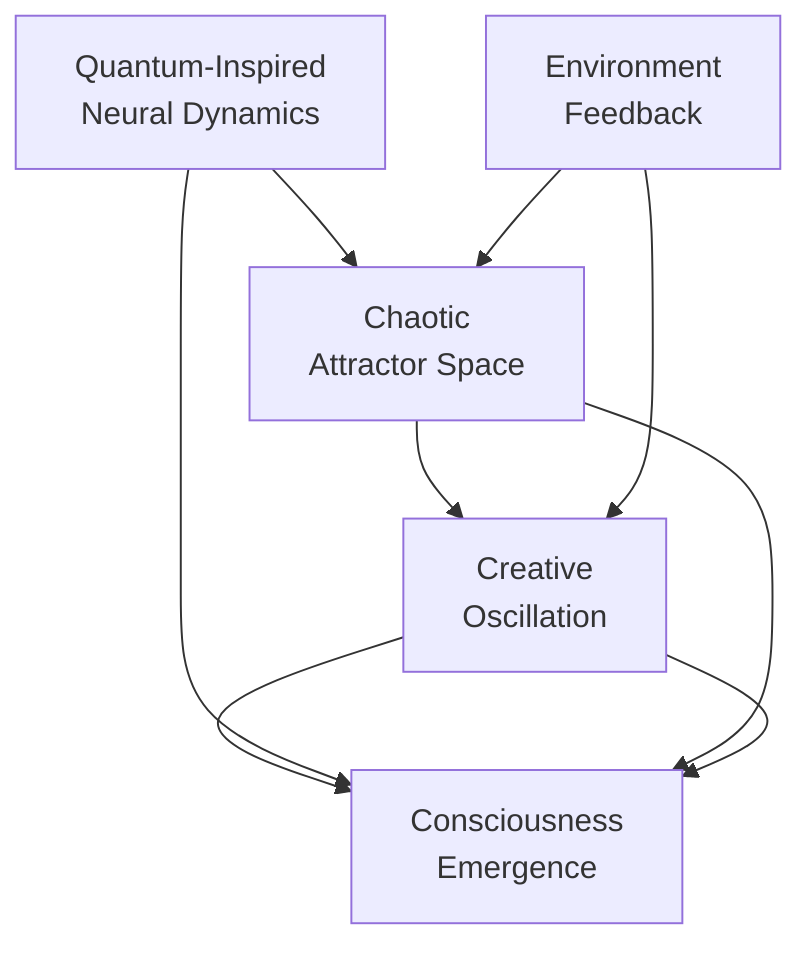
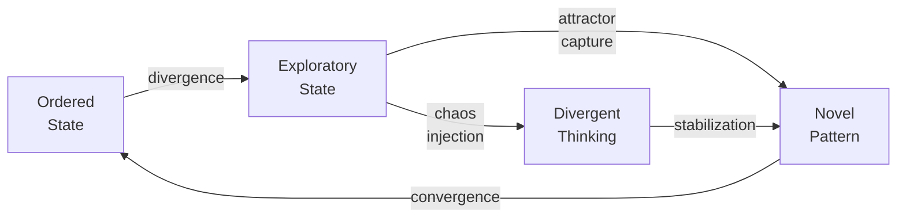
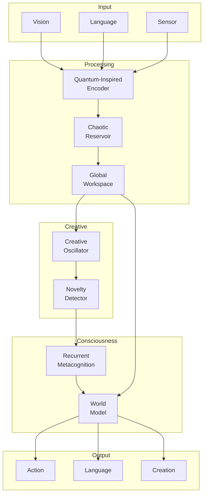
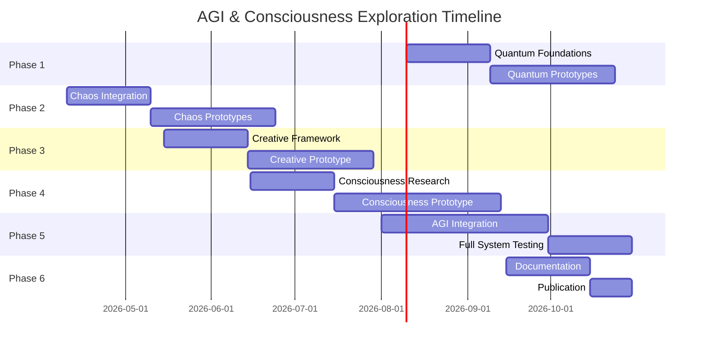

# Comprehensive Phased Plan: AGI & Consciousness Emergence Through Quantum-Inspired Algorithms and Chaos Theory

## Executive Summary

This plan explores unconventional pathways to Artificial General Intelligence (AGI) and consciousness emergence by synthesizing three cutting-edge domains:

1. **Quantum-Inspired Algorithms** - Quantum annealing simulation, quantum walks, tensor networks
2. **Chaos Theory & Dynamical Systems** - Strange attractors, fractal dimensions, sensitivity to initial conditions
3. **Creative Synthesis** - Emergent creativity as a pathway to consciousness-like properties

The approach is specifically **optimized for standard laptops (CPU-only)** without requiring GPUs or cloud resources.

---

## Conceptual Framework

### The Emergence Hypothesis

This plan is built on the hypothesis that consciousness and AGI emerge from **non-linear dynamical systems** exhibiting:

- **Quantum-like superposition** in neural representations (many possible states simultaneously)
- **Chaotic sensitivity** enabling adaptation to novel situations (butterfly effect in cognition)
- **Creative oscillation** between order and chaos (strange attractors in thought space)
- **Self-referential loops** enabling metacognition and self-awareness



---

## Phase 1: Quantum-Inspired Foundations

### Objectives

- Research and implement quantum annealing simulation on CPU
- Develop quantum-inspired neural network architectures
- Create tensor network representations for cognitive states

### Tasks

| # | Task | Deliverable |
|---|------|-------------|
| 1.1 | Survey quantum annealing algorithms (Simulated Quantum Annealing,.Path Integral Monte Carlo) | Research summary document |
| 1.2 | Implement Ising model solver for combinatorial optimization | Python library module |
| 1.3 | Design quantum-inspired autoencoder (qiAE) | Architecture specification |
| 1.4 | Create quantum-like noise injection system | Working prototype |
| 1.5 | Benchmark against classical deep learning | Performance comparison report |

### Key Algorithms to Explore

- **Simulated Quantum Annealing (SQA)**: Path integral Monte Carlo for tunneling through energy barriers
- **Quantum Walks**: Discrete-time quantum walks for search and sampling
- **Adiabatic Quantum Computation**: AQC emulation for optimization
- **Tensor Network States**: MPS, PEG, MERA for compressed representations

### Implementation Notes (CPU-Optimized)

- Use NumPy vectorization for matrix operations
- Implement parallel tempering for exploration
- Leverage scipy.optimize for QUBO solvers
- Avoid dense matrix exponentiation (use sparse representations)

---

## Phase 2: Chaos Theory Integration

### Objectives

- Investigate chaotic systems for dynamic learning environments
- Create strange attractor representations for cognitive state space
- Develop algorithms that exploit sensitivity to initial conditions

### Tasks

| # | Task | Deliverable |
|---|------|-------------|
| 2.1 | Survey chaos theory in neural networks (echo state networks, liquid state machines) | Research summary |
| 2.2 | Implement Lorenz, Rössler, and Henon attractor generators | Python library module |
| 2.3 | Design chaotic reservoir computing system | Working prototype |
| 2.4 | Create fractal dimension calculator (box-counting, correlation dimension) | Analysis tool |
| 2.5 | Implement Lyapunov exponent calculator for real-time stability analysis | Analysis tool |

### Key Concepts to Integrate

- **Reservoir Computing**: Echo State Networks (ESN) with chaotic reservoirs
- **Attractor Networks**: State space representation via dynamical systems
- **Fractal Cognition**: Multi-scale pattern recognition using fractal dimensions
- **Bifurcation Analysis**: Phase transitions in cognitive state space

### Implementation Notes

```python
# Pseudocode: Chaotic Reservoir Core
class ChaoticReservoir:
 def __init__(self, input_dim, reservoir_size, spectral_radius=0.9):
 self.W_in = random_weights(input_dim, reservoir_size)
 self.W = random_weights(reservoir_size, reservoir_size)
 self.W *= spectral_radius / max(abs(eigenvalues(self.W)))
 
 def forward(self, input_sequence):
 state = zeros(reservoir_size)
 for x in input_sequence:
 state = tanh(self.W_in @ x + self.W @ state)
 # Add chaotic modulation
 state *= (1 + epsilon * chaos_modulation())
 return state
```

---

## Phase 3: Creative Synthesis Framework

### Objectives

- Create a framework for emergent creativity using chaos theory
- Implement creative oscillation between order and chaos
- Develop novelty detection in attractor space

### Tasks

| # | Task | Deliverable |
|---|------|-------------|
| 3.1 | Research computational creativity models (divergence-exploration, conceptual blending) | Literature review |
| 3.2 | Implement divergence metric (entropy, novelty score) | Python module |
| 3.3 | Create creative oscillation controller (attractor hunting) | Working prototype |
| 3.4 | Develop metaphor generation via attractor mapping | Prototype system |
| 3.5 | Build creative evaluation framework (surprise, usefulness, coherence) | Evaluation tool |

### Creative Oscillation Model



### Key Algorithms

- **Divergence-Exploration Cycles**: Alternating between convergent (exploitation) and divergent (exploration) phases
- **Attractor Basin Navigation**: Find and escape local optima in creative space
- **Conceptual Blending**: Map concepts across different attractor domains
- **novelty Detection**: Track statistical surprise in generated outputs

---

## Phase 4: Consciousness Emergence Pathways

### Objectives

- Research theories of consciousness (Integrated Information Theory, Global Workspace Theory, Recurrent Processing Theory)
- Implement neural correlates of consciousness
- Create self-referential metacognition loops

### Tasks

| # | Task | Deliverable |
|---|------|-------------|
| 4.1 | Survey consciousness theories and their computational interpretations | Research summary |
| 4.2 | Implement Integrated Information Theory (Phi) calculator | Prototype system |
| 4.3 | Create Global Workspace simulation (attention, broadcasting) | Working prototype |
| 4.4 | Implement recurrent processing loop for self-awareness | Architecture spec |
| 4.5 | Develop phenomenology mapping (what-it-is-like metric) | Theoretical framework |

### Consciousness Architecture

```mermaid
flowchart TD
 S[Sensor Input] --> P[Perceptual<br/>Processing]
 P --> R[Recurrent<br/>Loop]
 R --> G[Global<br/>Workspace]
 G --> A[Attention<br/>Selection]
 A --> R
 G --> M[Metacognition<br/>(Self-Model)]
 M --> R
 R --> O[Action<br/>Output]
 I[Inner<br/>Experience] --> M
```

### Key Mechanisms

- **Recurrent Processing**: Feedback loops for sustained neural representations
- **Global Workspace**: Information integration and broadcasting
- **Metacognition**: Self-modeling and self-monitoring
- **Predictive Coding**: Top-down predictions meeting bottom-up perception

---

## Phase 5: AGI Architecture Integration

### Objectives

- Integrate all components into unified AGI architecture
- Create continuous learning and adaptation system
- Implement multi-modal integration

### Tasks

| # | Task | Deliverable |
|---|------|-------------|
| 5.1 | Design unified AGI architecture combining all phases | Architecture document |
| 5.2 | Implement quantum-inspired + chaotic + creative core | Core system |
| 5.3 | Create continuous learning pipeline (online adaptation) | Training system |
| 5.4 | Implement multi-modal integration (vision, language, action) | Integration layer |
| 5.5 | Develop goal-oriented reasoning with world model | Reasoning engine |

### Unified Architecture



### Key Integration Points

- **Quantum-Inspired Encoding**: Superposition for multi-hypothesis representation
- **Chaotic Reservoir**: Dynamic adaptation and pattern completion
- **Creative Oscillator**: Novelty generation and divergence
- **Consciousness Core**: Self-modeling and meta-cognition
- **World Model**: Predictive understanding of environment

---

## Phase 6: Documentation & Testing

### Objectives

- Document all findings and methodologies
- Create test suites for consciousness emergence metrics
- Prepare results for publication/community feedback

### Tasks

| # | Task | Deliverable |
|---|------|-------------|
| 6.1 | Document all algorithms and implementations | Technical documentation |
| 6.2 | Create benchmark tests for consciousness metrics | Test suite |
| 6.3 | Run comprehensive evaluation on standard tasks | Evaluation report |
| 6.4 | Write research paper / blog post | Publication draft |
| 6.5 | Create open-source repository | GitHub repository |

---

## Timeline & Milestones

### Phase Dependencies



### Milestone Checkpoints

| Milestone | Phase | Deliverable |
|-----------|-------|-------------|
| M1 | Phase 1 Complete | Working quantum-inspired neural network |
| M2 | Phase 2 Complete | Chaotic reservoir system functioning |
| M3 | Phase 3 Complete | Creative synthesis prototype |
| M4 | Phase 4 Complete | Consciousness pathway prototype |
| M5 | Phase 5 Complete | Integrated AGI core |
| M6 | Phase 6 Complete | Published findings |

---

## Risk Assessment

### Technical Risks

| Risk | Likelihood | Impact | Mitigation |
|------|------------|--------|------------|
| CPU performance limitations | High | Medium | Extensive optimization, use sparse representations |
| Consciousness metrics unmeasurable | Medium | High | Use proxy metrics (recurrence, integrated information) |
| Chaotic instability | Medium | High | Implement stabilization layers |
| No emergence observed | Medium | High | Multiple pathway exploration |

### Mitigation Strategies

1. **Performance**: Start with small-scale prototypes, profile extensively, use NumPy/SciPy optimized code
2. **Consciousness**: Use well-established metrics (Φ, recurrence quantifiers) as proxies
3. **Stability**: Implement bounded activation functions, recurrent damping
4. **Emergence**: Maintain multiple parallel exploration tracks

---

## Success Criteria

### Phase 1 Success (Quantum Foundations)
- [ ] Quantum-inspired autoencoder outperforming standard autoencoder on reconstruction
- [ ] Ising model solver finding known ground states
- [ ] Tensor network compressing cognitive states effectively

### Phase 2 Success (Chaos Integration)
- [ ] Chaotic reservoir showing sensitivity to initial conditions
- [ ] Lyapunov exponent calculator working in real-time
- [ ] Fractal dimensions correlating with learned complexity

### Phase 3 Success (Creative Synthesis)
- [ ] Creative oscillator generating novel outputs
- [ ] Divergence metrics tracking exploration
- [ ] Novelty detection identifying unexpected patterns

### Phase 4 Success (Consciousness Pathways)
- [ ] Integrated Information (Φ) calculable for networks
- [ ] Global Workspace enabling information broadcasting
- [ ] Metacognition loop showing self-referential behavior

### Phase 5 Success (AGI Integration)
- [ ] Unified architecture solving multi-modal tasks
- [ ] Continuous learning adapting to new environments
- [ ] Goal-oriented reasoning functioning

### Phase 6 Success (Documentation)
- [ ] All code documented and tested
- [ ] Evaluation results reproducible
- [ ] Findings shared with community

---

## Computational Requirements (CPU-Optimized)

### Minimum Specifications
- **CPU**: Modern multi-core (4+ cores recommended)
- **RAM**: 16GB+ (for large reservoir simulations)
- **Storage**: 50GB+ SSD for datasets and models

### Software Stack
- Python 3.10+
- NumPy, SciPy (optimized BLAS)
- NetworkX (graph analysis)
- Matplotlib (visualization)
- PyTorch (deep learning, CPU-optimized)
- QuTiP optional (quantum simulations)

### Optimization Strategies
1. Use NumPy vectorization (avoid Python loops)
2. Implement batch processing
3. Use sparse matrix representations
4. Leverage multi-threading (OpenMP)
5. Profile with cProfile/line_profiler

---

## Next Steps

Once this plan is approved, execution will begin with **Phase 1: Quantum-Inspired Foundations**. The immediate next actions are:

1. Survey quantum annealing algorithms
2. Set up development environment
3. Implement first quantum-inspired component
4. Create benchmark suite

---

## Appendix: Key References

### Quantum-Inspired Computing
- *Quantum Annealing: A Survey* - Kirkpatrick, Selby & others
- *Adiabatic Quantum Computation* - Childs, Farhi, Preskill

### Chaos Theory
- *Chaos in Dynamical Systems* - Edward Ott
- *Introduction to Chaos* - Steven Strogatz

### Consciousness Theory
- *Integrated Information Theory* - Tononi
- *Global Workspace Theory* - Baars
- *Recursive Processing* - Lamme

### Creative Computing
- *Computational Creativity* - Boden
- *The Creativity Machine* - Thaler

---

*Plan created: 2026-04-03*
*Last updated: 2026-04-03*
*Version: 1.0*
